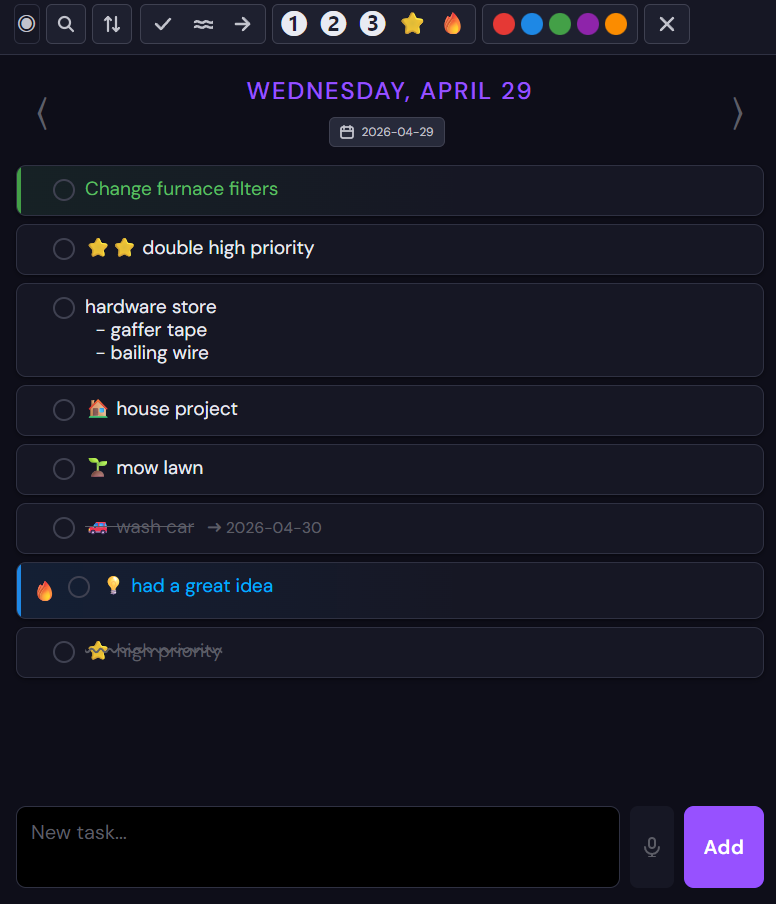

# Elixdo

[](https://github.com/brocla/elixdo/actions/workflows/ci.yml)

A personal daily todo list, built with Phoenix LiveView and deployed on Fly.io. Each day gets its own list. Items can be formatted, colored, reordered, and pushed forward to future dates. Changes sync instantly across all open devices — desktop and mobile stay in sync in real time.




The design mimics my use of todo lists on paper.  


## Access

The app is protected by a secret URL segment rather than a login. The URL looks like:

```
https://elixdo.fly.dev/<your-secret>/list/today
```

The secret is set via an environment variable (`SECRET_PATH`) on the server. Anyone who knows the URL can use the app — keep it private.

This method was chosen to lower the friction to login to near zero, to help the app compete well against paper.

## Using the App

- **Add items** — type in the input bar at the bottom and press Enter (or tap Add on mobile)
- **Voice input** — tap the microphone button to dictate an item (Android Chrome)
- **Select an item** — click the circle on the left to select it; the toolbar activates
- **Edit an item** — click the item text to edit it inline
- **Completed** — select an item and click ✓ in the toolbar
- **Abandoned** — select and click the wiggle button to mark an item as abandoned
- **Deferred** — push a selected item to a future date (→ button in toolbar); the original stays struck through with an annotation showing where it went
- **Priority** — assign a priority decoration (❶ ❷ ❸ ⭐ 🔥) that appears on the drag handle
- **Color** — apply a color to selected items via the toolbar swatches (desktop) or color button (mobile)
- **Sort active-first** — the sort button reorders the list so active items float to the top
- **Remove all formats** — the ✕ button clears color, priority, and status, restoring an item to active
- **Navigate dates** — use ‹ › arrows or the calendar picker; ◉ jumps back to today
- **Reorder** — drag and drop items within a day
- **Search** — click the magnifying glass to search across all items and all dates

Note, todo items can be edited and decorated, but not deleted. I never erased items off paper todo lists. I struck them out when complete. Wiggled them out if abandoned. And arrowed them out if moved to another day. But never deleted them.

## Updating the Secret

The secret URL path is controlled by the `SECRET_PATH` environment variable on Fly.io.

To change it:

```bash
fly secrets set SECRET_PATH=your-new-secret
```

Fly will automatically redeploy the app with the new secret. Anyone using the old URL will get a 404 until they update their bookmarks.

## Local Development

```bash
# Install dependencies and set up the database
mix setup

# Start the dev server
mix phx.server
```

Visit [http://localhost:4000/dev-secret/list/today](http://localhost:4000/dev-secret/list/today). The local secret defaults to `dev-secret`.

## Running Tests

```bash
mix test
```

## Deployment

See [DEPLOYMENT_README.md](DEPLOYMENT_README.md) for full instructions on deploying your own instance to Fly.io, including prerequisites, secrets, and volume setup.

## Push Notifications

Elixdo can send a push notification to your personal devices when anyone — a collaborator or an AI assistant — adds a new item. Regular users see and configure nothing; notifications are off by default.

To opt in on a device, visit `/<secret>/settings` and enable:

- **Notify me on this device** — this device will receive push notifications when new items are added
- **Don't send from this device** — suppress notifications triggered by your own additions on this device

Setting both flags on your personal devices means you are notified when others add items but not when you do. iOS requires the app to be added to your home screen before notifications can be enabled.

## AI / MCP Access

Elixdo exposes an embedded [MCP](https://modelcontextprotocol.io) server at `POST /api/v1/mcp`. This lets AI assistants (Claude Code, Claude.ai) read and write your lists directly.

**Available tools:** `get_today`, `list_items`, `list_items_range`, `add_item`, `update_item`, `arrow_item`, `search_items`

Authentication uses a bearer token set via the `AGENT_TOKEN` environment variable. To register with Claude Code:

```bash
claude mcp add --transport http --scope user elixdo https://elixdo.fly.dev/api/v1/mcp \
  --header "Authorization: Bearer <your-token>"
```

See [MCP_SERVER_PLAN.md](MCP_SERVER_PLAN.md) for full details.

## Deployment Scripts (PowerShell)

Two scripts in the repo root simplify common operations:

**`deploy.ps1`** — deploys to Fly.io with the current git SHA embedded, so the health endpoint can report which commit is live:
```powershell
.\deploy.ps1
```

**`check_deployment_level.ps1`** — compares the deployed SHA against recent commits so you can tell at a glance whether production is current:
```powershell
.\check_deployment_level.ps1
```
Output:
```
Deployed SHA: a1b2c3d

Recent commits:
a1b2c3d Fix suppress bug: export getDeviceId...
9929731 Phase 8: Web Push notifications...
```

## Tech Stack

- [Elixir](https://elixir-lang.org) / [Phoenix](https://phoenixframework.org) — web framework
- [Phoenix LiveView](https://hexdocs.pm/phoenix_live_view) — real-time UI without JavaScript
- [SQLite](https://sqlite.org) via [Exqlite](https://github.com/elixir-sqlite/exqlite) — embedded database
- [Fly.io](https://fly.io) — hosting, with a persistent volume for the SQLite file
